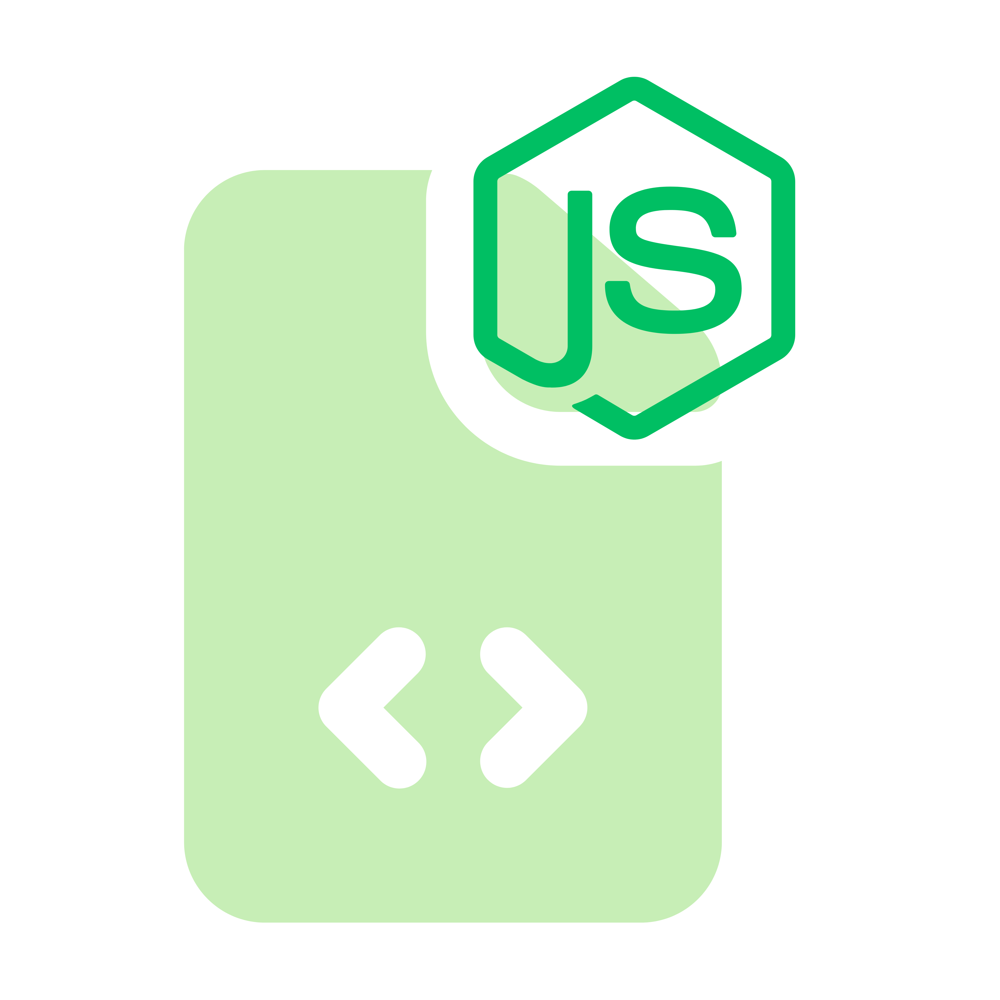

<div align="center">
  

  <h1>Shell2node</h1>

  <p>
	<a href="#features">features</a> •
	<a href="#Installation">Installation</a> •
	<a href="#Usage">Usage</a>
  </p>


  <p>
    <a href="https://github.com/Silent-Watcher/shell2node/blob/master/LICENSE">
      
    </a>
  </p>

  <p>⭐️ Please press the star! It greatly helps development! ⭐️</p>
  <p>Record shell commands and generate reproducible Node.js scripts with streaming child processes. Turn your terminal history into maintainable, shareable code.</p>

</div>

## Installation

```bash
npm install -g shell2node
```


## Features

- 🎥 **Interactive Capture Mode** - Records commands from your existing bash/zsh shell sessions
- 🔄 **Streaming Reproduction** - Generated scripts maintain original command streaming behavior
- ⚡ **Shell Semantic Preservation** - Uses `sh -c` to preserve shell features like pipes, redirections, and expansions
- 📁 **Automatic Organization** - Saves generated scripts with timestamps and metadata
- 🛡️ **Safe Execution** - Includes proper error handling and exit code propagation

## Usage

1. Start capture mode:
```bash
shell2node capture
```

2. Run your commands as normal:
```bash
# These will be recorded
find . -name "*.ts" -type f
cat file.txt | grep "pattern" | wc -l
curl -s https://api.example.com/data | jq '.items[]'
```

3. Save and generate script:
```bash
shell2node save
```

4. Run generated script:
```bash
node generated/2024-01-15T10-30-00Z-replay.js
```

## Example

**Captured commands:**
```bash
$ find src -name "*.ts" | xargs wc -l
$ cat data.json | jq '.metrics[]' | sort -n
```

**Generated Node.js script:**
```javascript
// Generated by shell2node (MLP)
// Captured commands: 2
// Generated at: 2024-01-15T10:30:00.000Z

import { spawnSync } from 'child_process';

function run(cmd) {
  console.log('> ' + cmd);
  const r = spawnSync('sh', ['-c', cmd], { stdio: 'inherit' });
  if (r.error) {
    console.error('Failed to run command:', r.error);
    process.exit(r.status || 1);
  }
  if (r.status && r.status !== 0) {
    console.error('Command exited with code', r.status);
    process.exit(r.status);
  }
}

(async () => {
  run(`find src -name "*.ts" | xargs wc -l`);
  run(`cat data.json | jq '.metrics[]' | sort -n`);
})();
```

## Who Is This For?

- **DevOps Engineers** - Convert deployment scripts into maintainable Node.js code
- **Data Scientists** - Reproduce complex data processing pipelines
- **System Administrators** - Document and version control administrative tasks
- **Developers** - Share complex build processes with team members
- **Technical Writers** - Create reproducible examples for documentation

## Supported Shells

- ✅ Bash (primary support)
- ✅ Zsh (full support)
- ⚠️ Other shells (basic support, may not capture all commands)


## Contributing

1. Fork the repository
2. Create a feature branch (`git checkout -b feature/amazing-feature`)
3. Commit changes (`git commit -m 'Add amazing feature'`)
4. Push to branch (`git push origin feature/amazing-feature`)
5. Open a Pull Request

---

## License

MIT — see `LICENSE` for details.

---

## Support

For support and questions, please open an issue on GitHub or contact [backendwithali@gmail.com](mailto:backendwithali@gmail.com)

---

<div align="center">
  <p>
    <sub>Built with ❤️ by <a href="https://github.com/Silent-Watcher" target="_blank">Ali Nazari</a>, for developers.</sub>
  </p>
  <p>
    <a href="https://github.com/Silent-Watcher/shell2node">⭐ Star us on GitHub</a> •
    <a href="https://www.linkedin.com/in/alitte/">🐦 Follow on Linkedin</a>
  </p>
</div>

